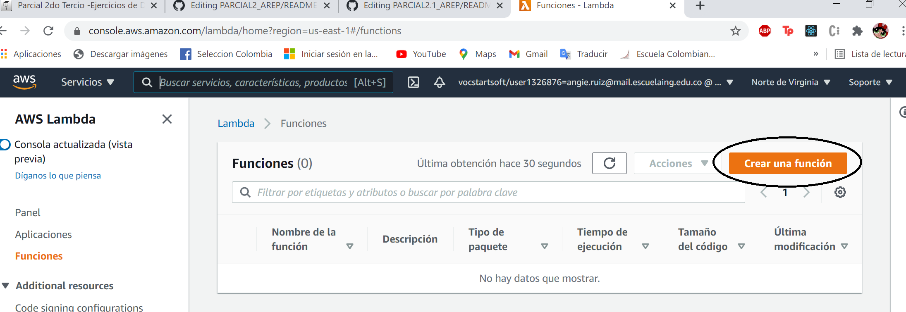
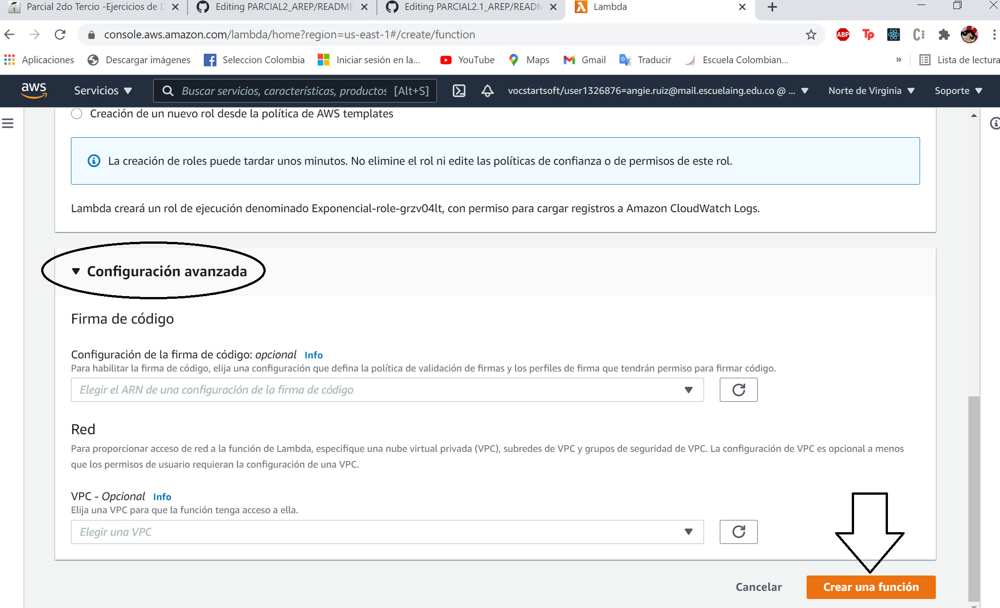
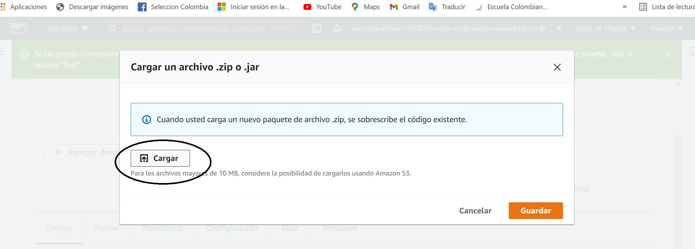
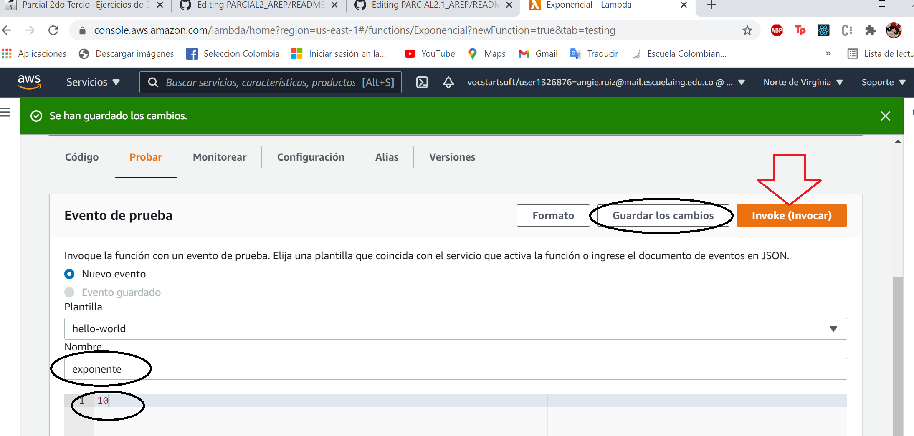
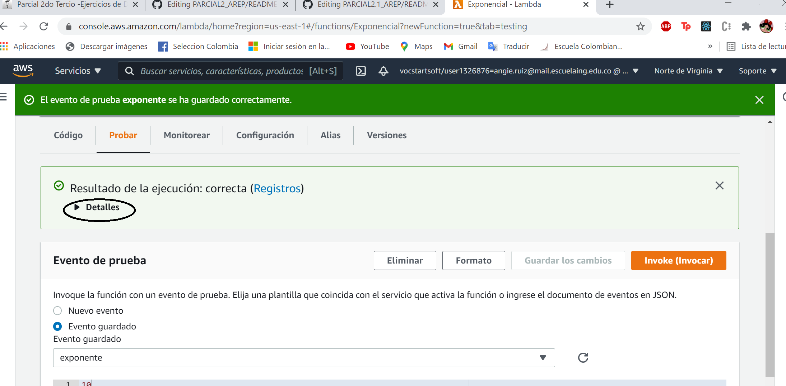
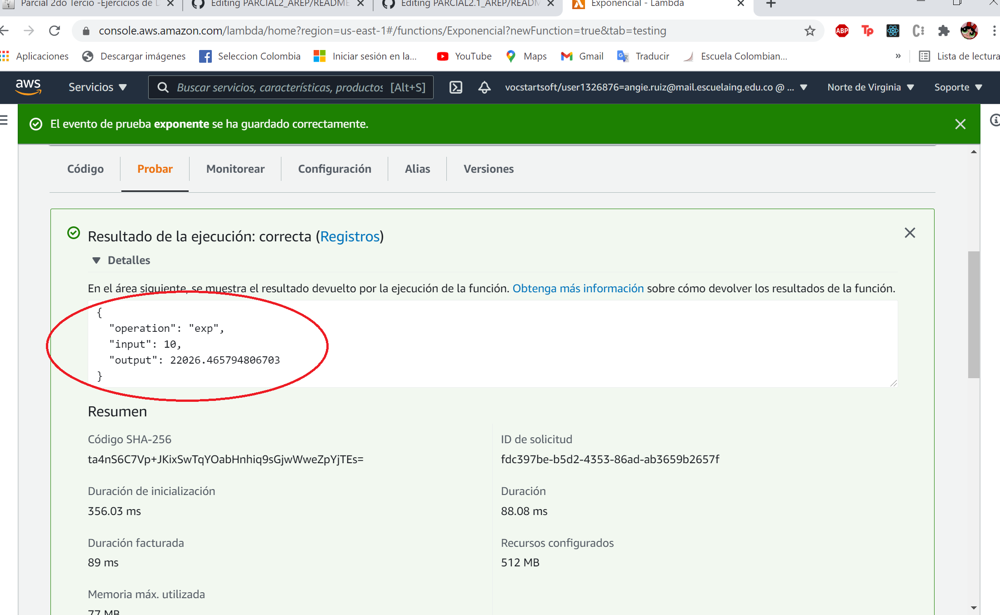
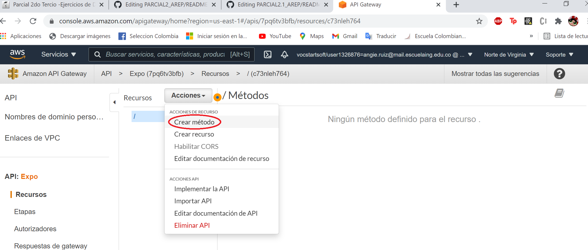

# EXAM SECOND TERM. 🚀

## Escuela Colombiana de Ingeniería - Enterprise Architectures(AREP).

Función exp

## Getting Started

### Prerequisites

- [Maven](https://maven.apache.org/) - Dependency Management.

- [Java 8](https://www.oracle.com/co/java/technologies/javase/javase-jdk8-downloads.html) -  Development Environment.

- [Git](https://git-scm.com/) - Version Control System.

- [Spark](http://sparkjava.com/) - Micro framework for creating web applications in Java 8.

Make sure you have this programs installed correctly and the version that we need with the following commands:

```
mvn --version
```

```
git --version
```

```
java -showversion
```

### Installing

1. Clone the repository:

```
git clone https://github.com/angiedanielar/PARCIAL2.1_AREP
```

2. Compile the projet:

```
mvn package
```

3. Executing the program:

```
mvn exec:java -D "exec.mainClass"="edu.escuelaing.arep.app.App"
```
And put this link in your browser: http://localhost:4567

- Example to use: http://localhost:4567/exp?value=2

5. Generating the documentation:

```
mvn javadoc:javadoc
```

## Lambda: Step by step




















## API-Gateway: Step by step





## How to use

- [Link to the deploy](https://7pq6tv3bfb.execute-api.us-east-1.amazonaws.com/prueba)


Lambda:


API-Gateway:


## Built With

- [Maven](https://maven.apache.org/) - Dependency Management

- [Java 8](https://www.oracle.com/co/java/technologies/javase/javase-jdk8-downloads.html) -  Development Environment.

- [Git](https://git-scm.com/) - Version Control System.

- [Spark](http://sparkjava.com/) - Micro framework for creating web applications in Java 8.

## Author

- Angie Daniela Ruiz Alfonso.


## License

This project is under GNU General Public License - see the [LICENSE](LICENSE) file for details.
